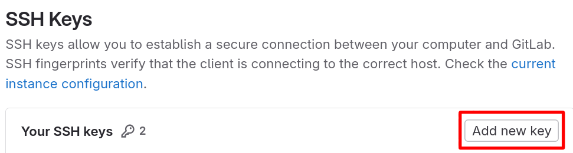
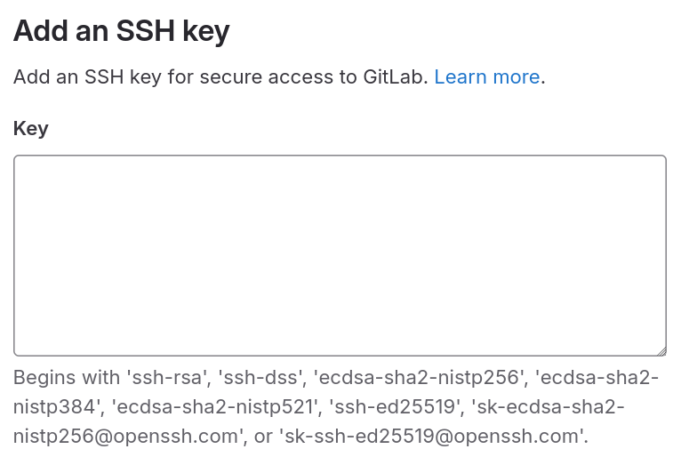

# Setting up SSH and Git on Linux

## Set up an SSH key

You will use git to synchronize your local work with the lab project on Chalmers GitLab. For this, you need an SSH key.

1. If you have not generated an SSH key before: open a terminal and run `ssh-keygen`, leaving all input prompts empty (including empty password). It should print the path to your public key. Look for something like:
```
Your public key has been saved in /home/<username>/.ssh/id_<something>.pub
```
2. Find the file above in your file manager. If your can't see the `.ssh` folder, you may need to turn on the setting to show hidden folders. Open it with a text editor and copy the contents, as you will need to paste it into Gitlab later. It should look something like this (the initial part may differ depending on settings): "ssh-ed25519 longstringofnumbersandcharacters user@computer"
3. Add the contents of this file as a [key on Chalmers GitLab](https://git.chalmers.se/-/user_settings/ssh_keys).

Paste the contents of the file you copied before into the **key** textbox. You don't need to change anything else.

4. Check your setup by running `ssh -T git@git.chalmers.se` in your terminal. You may be prompted to confirm the authenticity of the host. The command should then print a welcome sentence:

```
Welcome to GitLab, @username!
```

Here are [more detailed/advanced instructions](https://git.chalmers.se/help/user/ssh.md). If you have any problems, ask on Discord or talk to a teaching assistant during lab supervision.

## Install Git

[Git](https://en.wikipedia.org/wiki/Git) is the industry standard for version control and collaborative software development. You can find instructions for how to install it on different distributions [here](https://git-scm.com/downloads/linux). It will pay off to [become familiar](https://git.chalmers.se/help/gitlab-basics/start-using-git.md) with it!