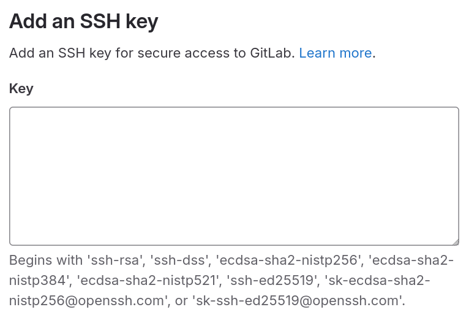

# Setting up SSH and Git on Windows

## Set up an SSH key

You will use git to synchronize your local work with the lab project on Chalmers GitLab. For this, you need an SSH key.

1. If you have not generated an SSH key before: open a terminal and run `ssh-keygen`, leaving all input prompts empty (including empty password). It should print the path to your public key. Look for something like:
```
Your public key has been saved in C:\Users\<username>/.ssh/id_<something>.pub
```
2. Open file explorer and follow the path above. If your can't see the `.ssh` folder, you may need to [turn on the setting to show hidden folders](https://support.microsoft.com/en-us/windows/view-hidden-files-and-folders-in-windows-97fbc472-c603-9d90-91d0-1166d1d9f4b5#WindowsVersion=Windows_11). To open this file, you may need to right-click, choose open with and select a text editor. Copy the contents, as you will need to paste it into Gitlab later. It should look something like this (the initial part may differ depending on settings): "ssh-ed25519 longstringofnumbersandcharacters user@computer"
3. Add the contents of this file as a [key on Chalmers GitLab](https://git.chalmers.se/-/user_settings/ssh_keys).

Paste the contents of the file you copied before into the **key** textbox. You don't need to change anything else.

4. Check your setup by running `ssh -T git@git.chalmers.se` in your terminal. You may be prompted to confirm the authenticity of the host. The command should then print a welcome sentence:

```
Welcome to GitLab, @username!
```

Here are [more detailed/advanced instructions](https://git.chalmers.se/help/user/ssh.md). If you have any problems, ask on Discord or talk to a teaching assistant during lab supervision.

**Note**: If you use the Chalmers lab computers, you may experience a problem with git cloning. This is due to the following:

- `ssh-keygen` puts the key in `.ssh` in your user folder on the C drive.
- git looks for your key in `.ssh` in your Z drive.

To solve this, just copy over the `.ssh` directory from your user folder on the C drive to the Z drive.

## Install Git

[Git](https://en.wikipedia.org/wiki/Git) is the industry standard for version control and collaborative software development. You can download it from [here](https://git-scm.com/downloads/win). It will pay off to [become familiar](https://git.chalmers.se/help/gitlab-basics/start-using-git.md) with it!