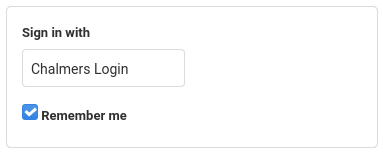
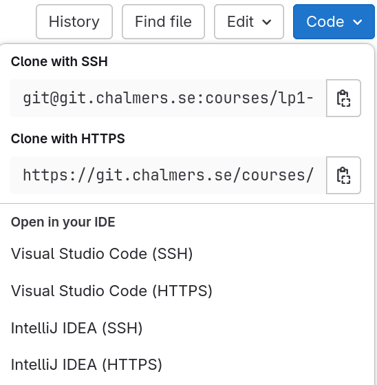
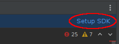
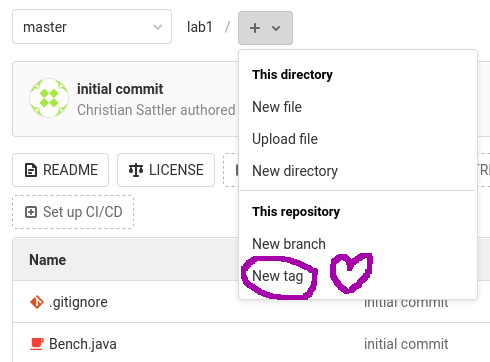
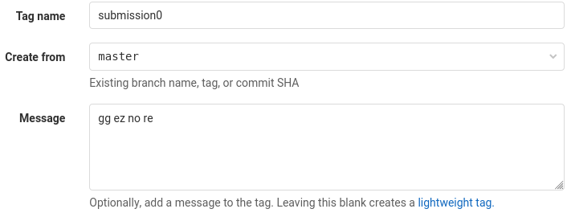
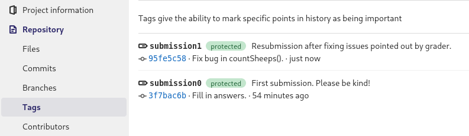

# Working with Chalmers GitLab

## Access Chalmers GitLab

Open [Chalmers GitLab](https://git.chalmers.se/dashboard/projects) (git.chalmers.se). Sign in with **Chalmers Login** (ignore the username/password fields):



You will see all your current projects. If a lab project is missing, it could be because:

- The lab has not yet been published.
- An invitation was sent to your Chalmers student address, but you have not yet accepted it.
- The lab is done in groups and you have not [joined a lab group](lab-info.md#joining-a-group).

If you still do not see the project after refreshing 5 minutes later, our systems are down. Let us know!

## Configure your account

GitLab will notify you about new lab projects and gradings of your submissions via your Chalmers student address. You can change this by [adding an email address](https://git.chalmers.se/-/profile/emails) and then setting this as the [notification email](https://git.chalmers.se/-/profile/notifications). **Make sure to configure an email address you actually read.**

You can also [set your name](https://git.chalmers.se/-/profile) and a profile picture, if you wish.

## Work on a lab

For each lab assignment, we add you as a developer to a project on Chalmers GitLab. Scrolling down past the file listing, you will see the lab description (this is the file `README.md`, written in Markdown). You can use this project as you see fit (issues, merge requests, etc.), but mainly it consists of a **git repository**. For group projects, you can choose how to collaborate: together on one computer or everyone using their own computer and using git to synchronize changes.

Each lab comes with specific instructions on what you should implement and what questions you should answer (in `answers.txt`). Please do not change the signatures or behaviour of pre-existing methods unless instruncted as it will make your submission harder for us to test and grade. Of course, you are allowed to add things that do not affect the existing functionality (new variables, functions, methods, classes, and, most importantly, comments).

### Set up an SSH key and install Git

See the separate instructions for Windows, Linux and MacOS for how to create an SSH key and install git. When you're ready, follow the instructions below to get started.

- [Instructions for Windows](chalmers-gitlab-windows.md)
- [Instructions for Linux](chalmers-gitlab-linux.md)
- [Instructions for MacOS](chalmers-gitlab-macos.md)

### Configure Git

Before you can make a commit (upload your code) you will have to set your name and email. You can set it either locally (for a specific project) or globally (for all projects). Open a terminal and run either of the following commands. To set a local configuration, you need to be in a repository so this can't be done before you have cloned it (which you will do below). You will soon learn how to clone (download) it.

#### Global configuration
``` shell
git config --global user.name "Full name"
git config --global user.email "cid@chalmers.se"
```

#### Local configuration
``` shell
git config --local user.name "Full name"
git config --local user.email "cid@chalmers.se"
```

### Clone the repository

To interact with the provided git repository, you have several options. By clicking on the **Code** button on Gitlab you get a number of alternatives. If you're using one of the IDEs listed, you can click on it (SSH version) to open it automatically. Otherwise follow the instructions below to use git clone or the integrated Git tools in your IDE.



#### Use Git clone
- [Clone](https://git.chalmers.se/help/gitlab-basics/start-using-git.md#clone-with-ssh) the git repository by copying the SSH address above and running the following command.

``` shell
git clone <SSH address>
```

#### Use IDE tools

If you use an IDE such as IntelliJ or Eclipse, it comes with built-in git integration. For example, in IntelliJ, simply create a project using ***File → New → Project from Version Control*** and paste the repository SSH URL you get from the project page by clicking on ***Clone***.

  **Note**: If IntelliJ highlights lots of strange errors after cloning, you need to set up the project SDK (any recent version will do):

  

  Alternatively, go to ***File → Project Stucture...*** and specify a Project SDK version.

To simplify things, we suggest you only use the default branch (called ***main***) and do not create extra branches. Then you won't have to interact with the branching functionality of git.

### Switching programming language

Each lab is offered in two version: Java and Python. You can choose which one to work with. If you just open the project, you get the Python version. To switch to Java, read on.

There are branches ***java*** and ***python*** in your project. You can have a look at them, but they cannot be modified (they represent the starting state that your submission will be compared against). Instead, you work on the default branch ***main***. By default, it points to ***python***. To change it to Java, you can run the following git commands:

- `git switch --force-create main origin/java`
- `git push --set-upstream --force origin main`

**Warning**: this will erase all previous work on branch ***main***. You can make a backup beforehand if desired:

- `git branch main-backup main`

### Make changes to your code

Now you're ready to start working on the labs! If you're multiple people working on the lab at the same time, make sure you [pull](https://git.chalmers.se/help/gitlab-basics/start-using-git.md#download-the-latest-changes-in-the-project) any changes your other group members might have made in your IDE or using the command:

``` shell
git pull
```

After you've made some changes to the code or your answers and want to [commit](https://git.chalmers.se/help/gitlab-basics/start-using-git.md#add-and-commit-local-changes) (upload) them to Gitlab, you first have to stage your them. Either do it in your IDE or run:

``` shell
git add -u
```

Now you can make a commit, which stores what the staged code looks like at the moment. Either click on commit in your IDE or run the command below. You will have to specify a commit message. The contents of the message aren't important, but will be displayed on Gitlab for all eternity.
``` shell
git commit
```

Finally, you can [push](https://git.chalmers.se/help/gitlab-basics/start-using-git.md#send-changes-to-gitlabcom) your changes to make them appear on Gitlab. Either click the button in your IDE or run:
``` shell
git push
```

For a summary of useful commands, see the [git cheatsheet](https://about.gitlab.com/images/press/git-cheat-sheet.pdf).

### Robograder

We contracted elite roboticists to build 
<span style="background-color: #ffff00;">R</span><span style="background-color: #ffaf40;">o</span><span style="background-color: #ff8080;">b</span><span style="background-color: #ff40af;">o</span><span style="background-color: #ff00ff;">g</span><span style="background-color: #af40ff;">r</span><span style="background-color: #8080ff;">a</span><span style="background-color: #40afff;">d</span><span style="background-color: #00ffff;">e</span><span style="background-color: #4fffaf;">r</span>™. 
You should **test your code** with Robograder to iron out bugs before you submit. To call Robograber, create a tag like you would for a submission (explained below). But use a **test tag**, starting with `test` (for example `testPlzKThx`). Robograder will respond with an issue in your project. Often it is fast, but it can take up to 15 minutes. You should be notified by email (see above how to set this up).

You are allowed to use Robograder **five times** for each lab. This limitation is to prevent test spamming and encourage you to think instead.

## Submit a lab

We use the **tags** feature of git for lab submission. When you are ready to submit, go to your project page on GitLab and create a tag:



The name of a **submission tag** must start with `submission` (make sure to spell correctly). If you want to be nice, add a number (0, 1, 2, …) to indicate your submission attempt. Example:



You can write a submission comment in the message field.

Once you have created a submission tag, you cannot change it: it serves as your proof of submission. You can still push new commits to the repository, but this won't change the tagged version of your code (the commit the tag points to). Therefore, make sure to tag exactly the version you mean to hand in (be extra careful if you work with multiple branches). If you accidentally put the tag in the wrong place, you can use a new tag. For example, if `submission0` ended up on the wrong commit, put `submission1` on the right one and we will ignore the previous tag.

**Note**: The tag must live in the Chalmers GitLab repository, not just your local git clone. If you create the tag locally and then push, make sure to **push tags**.

You can check your submission by visiting ***Repository → Tags***. The submission tag should be highlighted as 
<span style="background-color: #bfedd2; color: #006000; padding: 0 10px; border-radius: 10px">protected</span>:



## Get feedback

After you submit a lab, we add you to a special **grading merge request** for your submission. There you can see the grading status of all your submissions. The graders will give their feedback by commenting in this merge request (you should be notified by email).

- Use the **discussion thread** in the merge request to respond to the feedback, ask for clarifications, or complain about the grading. Your grader will respond.

If you did not pass in the first grading and wish to resubmit, create a new submission tag (e.g. `submission1`).
